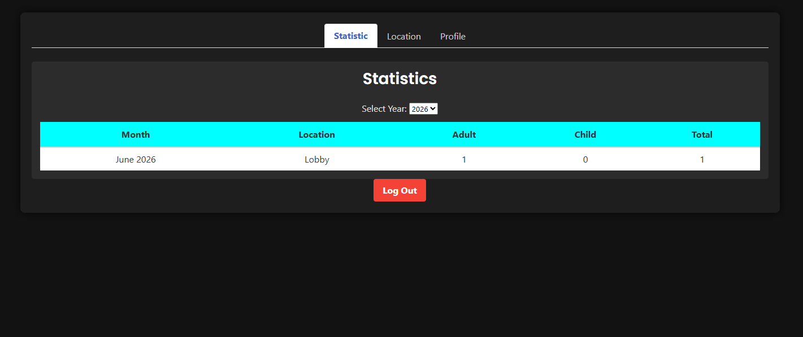

# Visitor Tracking Web App

A lightweight PHP/MySQL visitor registration and movement tracking app. Visitors register once, receive a reusable digital card, and can scan location QR links as they move between locations.

## Main Flow

- First-time visitor scans a location QR and completes the registration form.
- The app stores the visitor profile and today's first visit.
- If the same visitor scans another location on the same day, the app records the new location and shows the updated digital card.
- If the visitor returns on another day, the app asks whether they came alone.
- If they came alone, the app records a new visit for that day automatically.
- If they came with others, the app opens a short form to capture adult and child counts.

## Local Setup

- Put the project in an Apache/PHP web root, for example `htdocs/visitor`.
- Import `database/init.sql` into MySQL.
- Update database credentials in `config/config.php` if needed.
- Open `http://localhost/visitor/views/public/kiosk.php`.

Default admin:

- Username: `admin`
- Password: `admin123`

## Third-Party Credits

- Bulma via jsDelivr CDN
- Iconify
- SweetAlert2
- QRTag QR image endpoint
- Google Fonts: Poppins, Open Sans, Quantico, Chakra Petch

Bundled illustrative PNG icons are placeholder/demo assets.

## License

CC BY-NC-SA 4.0. See `LICENSE`.

## Screenshots

