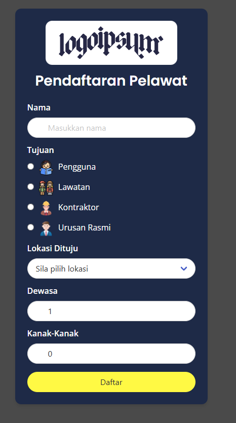
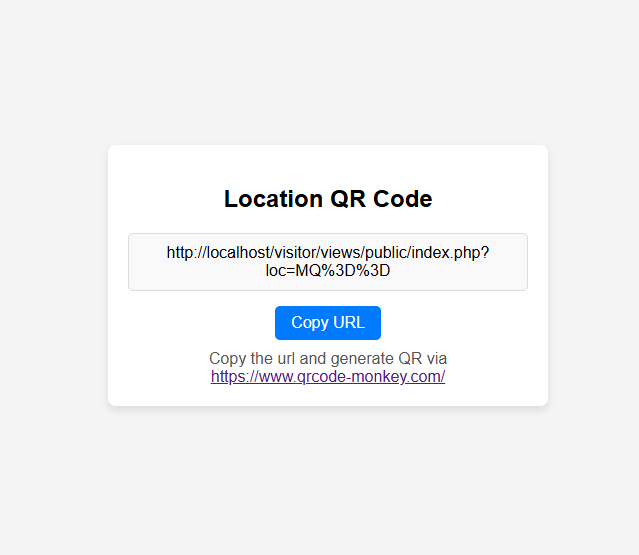
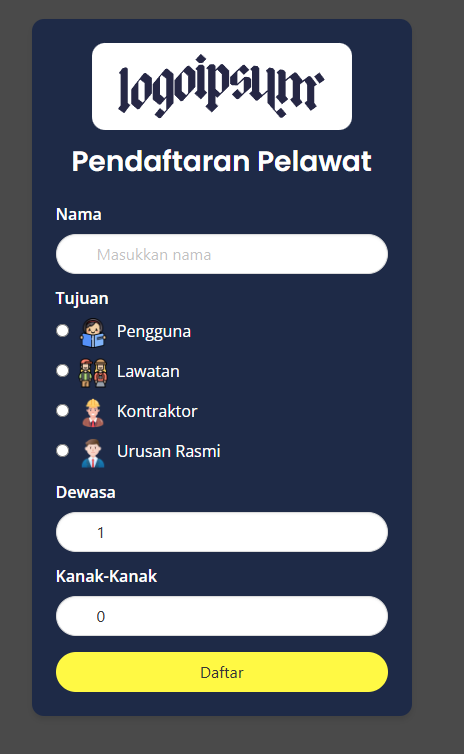
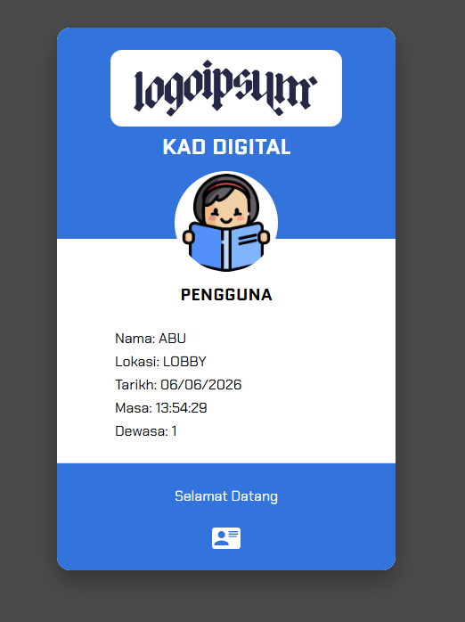

# Simple Visitor Registration

A lightweight PHP/MySQL visitor registration and movement tracking web app. Visitors register once, receive a reusable digital card, and can scan location QR links as they move between locations.

## Features

- Kiosk registration form for first-time visitors.
- Location QR links for tracking visitor movement.
- Same-day scans record movement between locations without repeating full registration.
- Next-day scans prompt whether the visitor came alone.
- Digital visitor card retrieval using random card tokens.
- Basic admin panel for locations, users, and statistics.
- Localhost/folder-aware URL generation for easier reuse.

## Main Flow

- First-time visitor scans a location QR and completes the registration form.
- The app stores the visitor profile and today's first visit.
- If the same visitor scans another location on the same day, the app records the new location and shows the updated digital card.
- If the visitor returns on another day, the app asks whether they came alone.
- If they came alone, the app records a new visit for that day automatically.
- If they came with others, the app opens a short form to capture adult and child counts.

## Local Setup

1. Place the project in an Apache/PHP web root, for example `htdocs/visitor`.
2. Import `database/init.sql` into MySQL.
3. If this is an existing install, also run `database/security_migration.sql`.
4. Update database credentials in `config/config.php` if needed.
5. Open the kiosk page:

```text
http://localhost/visitor/views/public/kiosk.php
```

Default admin:

```text
Username: admin
Password: admin123
```

Change the default admin password immediately after first login.

## Useful URLs

```text
Kiosk registration:
http://localhost/visitor/views/public/kiosk.php

Admin login:
http://localhost/visitor/views/admin/log-masuk.php
```

Location QR URLs are generated from the admin location page.

## Security Notes

This revived legacy app includes basic hardening:

- Admin APIs require login and CSRF tokens.
- Visitor card links use random tokens instead of guessable numeric IDs.
- Visitor cookies use `HttpOnly`, `SameSite=Lax`, and `Secure` when HTTPS is active.
- Admin login regenerates the session ID.
- Raw database errors are not returned to users.

Before deploying publicly, review server configuration, HTTPS, database credentials, and operational logging.

## Screenshots








